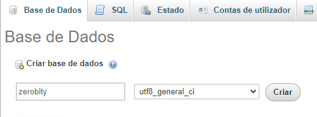
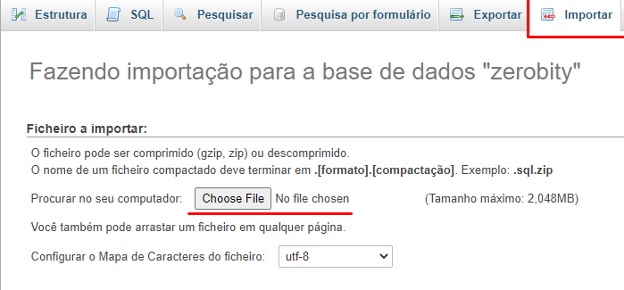
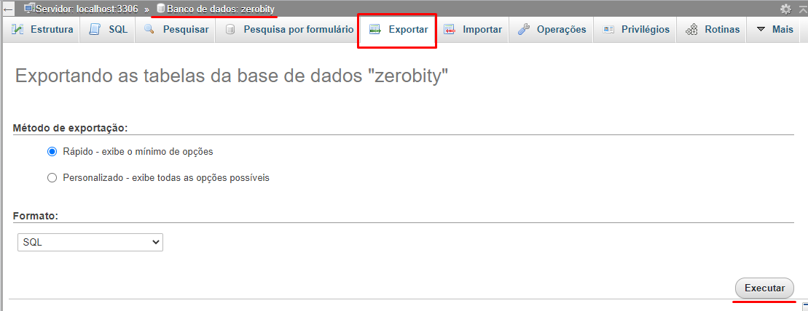
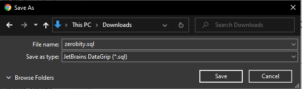

# Zerobity

## Instalação de Dependencias

Para instalar todas as dependências usadas no projeto (sejam elas novas, ou atualizações), use o comando abaixo:

	npm install

### **Instalação do Yarn**

Neste projeto, ao invés do **npm**, o **yarn** é utilizado como gerenciador de pacotes principal, por esse motivo, instale o yarn com o seguinte comando:

	npm install --global yarn

**Este comando instala o __yarn__ globalmente, para instalar o __yarn__ apenas neste projeto, utilize o comando abaixo:*

	npm install yarn

## Configuração de Variáveis de Ambiente

Crie um arquivo `.env` para configurar as variáveis de ambiente usada no código.

Seu arquivo `.env` deve se parecer com algo assim:

	PORT=PORTA_DO_PROJETO
	MYSQL_HOST=HOST_DO_BANCO_DE_DADOS
	MYSQL_PORT=PORTA_DO_BANCO_DE_DADOS
	MYSQL_USER=USUARIO_DO_BANCO_DE_DADOS
	MYSQL_PASSWORD=SENHA_DO_BANCO_DE_DADOS
	MYSQL_DATABASE=NOME_DO_BANCO_DE_DADOS

Para atribuir um valor nulo/vazio a uma váriavel, apenas faça como o exemplo abaixo:

	VARIAVEL=

### **Exemplo de Variáveis de Ambiente**

	PORT=3333
	MYSQL_HOST=localhost
	MYSQL_PORT=3306
	MYSQL_USER=root
	MYSQL_PASSWORD=
	MYSQL_DATABASE=zerobity
	

Todas as variáveis devem ser declaradas em letras maísculas e com `_` (_underline_/_underscore_) para indicar espaçamentos.

## Importando o Banco de Dados

Existem uma chance de quase 100% de certeza que o banco de dados não será o mesmo que a última vez que você o viu, seja em questão de tabelas a mais ou a menos, registros alterados, excluídos ou adicionados.

Por isso, lembre-se de sempre fazer o download do arquivo `zerobity.sql` e importá-lo em seu DBMS **(Database Management Systems - Sistemas de Gerenciamento de Banco de Dados)**.

### Exemplo de importação no **phpmyadmin**:

1. Criando um novo banco de dados
	
	* Escolha um nome para o banco de dados
		* O mesmo nome do valor da variável `MYSQL_DATABASE` no arquivo `.env`

	

2. Importando tabelas e registros

	* Faça download do arquivo `zerobity.sql`
		* Encontre o arquivo no seu computador e execute a ação

	

3. Pronto! Agora você pode programar normalmente

## Exportando o Banco de Dados

Sempre que fizer alguma alteração no banco de dados, seja até mesmo um novo registro, lembre-se de exportá-lo e salvar o arquivo no repositório.

Salve o arquivo com o nome de `zerobity.sql`.

### Exemplo de exportação no **phpmyadmin**:

1. Acesse a aba "Exportar"

	

2. Salve o arquivo

	

## Deploy da Aplicação | _EM BREVE_

...
